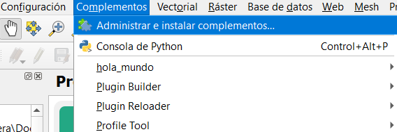
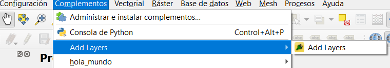

# Add Layers Plugin
## Añade capas con un solo botón

Proyecto iniciado con la finalidad de facilitar el proceso de adición de capas al software QGIS, ya que este no cuenta
con una sola forma para añadirlas y por consiguiente resulta en una experiencia pobre para el usuario.

# Instalación

> El proceso de instalación cambiará cuando se publique el plugin

Es necesario clonar el repositorio con el siguiente comando `git clone https://github.com/RDR96/Add_Layers_Plugin.git` dentro de la carpeta `..\python\plugins\` que se encuentra en la ubicación del software
de QGIS. 

> Tip: Posiblemente la ruta completa en Windows es: `C:\OSGeo4W64\apps\qgis\python\plugins\`

Luego de clonar el proyecto será necesario activar el plugin en QGIS desde la ventana de Administración de complementos:

Encontraremos el plugin desde la ventana como se muestra:

Marcamos el plugin para poderlo activar

Cerramos la ventana y ya es posible utilzar el plugin.

# Modo de uso

Para poderlo utilizar nos dirigimos a la misma sección de complementos y damos click en el plugin Add Layers:

Se abrirá la siguiente ventana:

Le daremos en el botón **Importar archivos** el cual nos abrirá el gestor de archivos para agregar las capas que necesitemos.
Repetimos este proceso hasta tener las que necesitemos:

Le damos al botón **Aceptar** y obtenemos el siguiente resulto:

